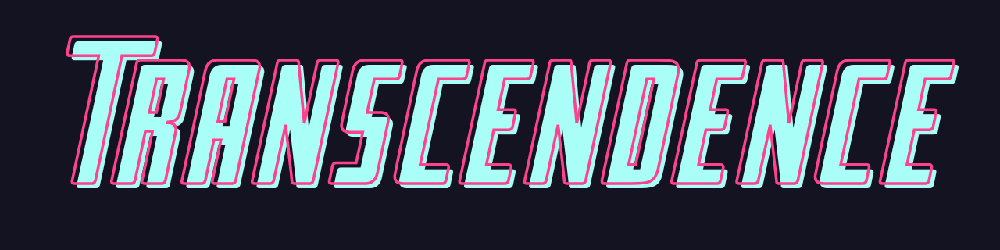

# Transcendence

This project is about recreating the famous Pong by Atari.
It is a group project done with [Levi Jimenez](PepeLevi), [Esther Mollebr](https://github.com/emollebr) and [Jakob Schott](https://github.com/jakobsitory)

The full subject can be found [here](assets/en.subject.pdf).
